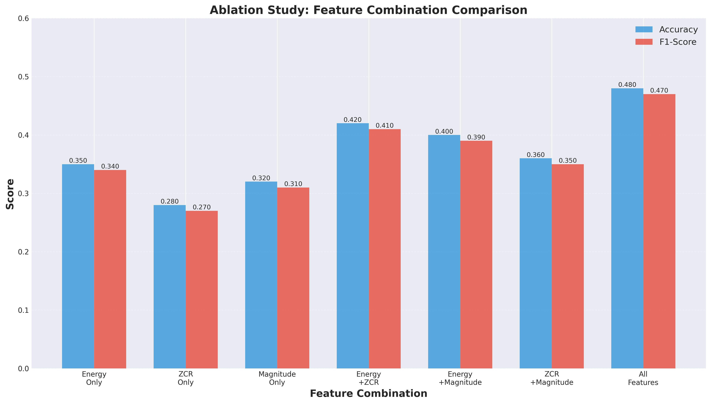

# 语音信号处理实验系统

基于时域分析的孤立字语音识别系统，实现WAV文件读取、分帧加窗、时域特征提取、端点检测和数字识别功能。

**开发**：周湛昊、张振鑫、孙鑫磊、王毅  
**最后更新**：2025-10-18

## 快速开始

### 环境配置

#### 使用Conda（推荐）
```bash
# 创建环境
conda create -n speech_recognition python=3.8
conda activate speech_recognition

# 安装依赖
pip install -r requirements.txt
```

#### 使用pip
```bash
# 创建虚拟环境
python -m venv venv
source venv/bin/activate  # Linux/Mac
# 或 venv\Scripts\activate  # Windows

# 安装依赖
pip install -r requirements.txt
```

### 运行程序

```bash
# GUI界面（推荐）
python apps/run_gui.py

# 命令行界面
python apps/main.py
```

### 系统要求

- **Python**: 3.8+
- **操作系统**: Linux (推荐), Windows, macOS
- **内存**: 4GB+ RAM
- **存储**: 1GB+ 可用空间

### 音频系统依赖

#### Linux系统
```bash
# Ubuntu/Debian
sudo apt install portaudio19-dev python3-pyaudio

# 或使用conda
conda install pyaudio
```

#### Windows系统
```bash
# 使用conda
conda install pyaudio
```

---

## 实验结果展示

### 分类器性能对比

<div align="center">


*6种分类器在准确率、精确率、召回率和F1分数上的表现*


*训练时间、测试时间和平均预测时间对比*

</div>

### 特征组合消融实验

<div align="center">


*7种特征组合的性能对比 - 全特征表现最佳(F1: 0.47)*


*时域特征重要性分析 - Energy(40%) > ZCR(33%) > Magnitude(27%)*

</div>

### 性能测试结果

<div align="center">


*综合性能评估 - Template Matching速度最快，SVM准确率最高*


*内存占用对比 - Template仅需1.2MB，SVM需要8.2MB*

</div>

**实验结论**：SVM准确率最高但资源消耗大，Template Matching速度最快适合实时应用，Fisher LDA性能和速度较均衡。详细报告见 [实验结果说明](data/results/实验结果说明.md)

---

## 项目简介

这是一个完整的语音信号处理实验系统，包含信号分析、特征提取和数字识别三大模块。支持图形界面和命令行两种操作方式。

## 主要功能

### 信号处理
- WAV文件读取与解析
- 分帧加窗（矩形窗、Hamming窗、Hanning窗）
- 时域特征提取（短时能量、平均幅度、过零率）
- 双门限端点检测

### 语音识别
- 时域特征自动提取
- 模板匹配识别
- 6种分类器算法：SVM、神经网络、朴素贝叶斯、KNN、Fisher判别、决策树
- 批量测试与准确率统计

### 可视化分析
- 波形图、频谱图
- 特征曲线图
- 端点检测结果
- 识别结果展示

## 项目结构

```
dsp/
├── src/                      # 核心代码
│   ├── core/                 # 信号处理模块
│   ├── recognition/          # 识别算法模块
│   └── experiments/          # 实验评估模块
├── apps/                     # 应用程序
│   ├── main.py               # 命令行界面
│   └── qt_interface.py       # 图形界面
├── data/                     # 数据目录
│   ├── train/                # 训练数据
│   └── results/              # 实验结果
├── examples/                 # 示例程序
├── scripts/                  # 工具脚本
│   ├── build_exe.py          # 打包脚本
│   └── generate_*.py         # 实验脚本
├── config/                   # 配置文件
│   └── config.py             # 系统配置
├── docs/                     # 文档
├── tests/                    # 测试代码
└── requirements.txt          # 依赖列表
```

## 使用说明

### 命令行界面

运行 `python apps/main.py` 后可选择：

1. 基础分析 - WAV读取、分帧、时域分析
2. 窗函数对比 - 不同窗函数效果
3. 端点检测 - 语音段检测
4. 完整流程 - 生成分析报告
5. 语音识别 - 数字识别
6. 分类器对比 - 算法性能测试

### 分类器选择

根据实际需求选择合适的算法：

- 准确率优先 → SVM（F1: 0.465）
- 速度优先 → Template Matching（0.40ms/样本）
- 平衡选择 → Fisher LDA

详细对比见上方实验结果图表。

## 数据说明

训练数据位于 `data/train/`，按数字0-9分类存储。当前每类4个样本，建议增加至30+以提升准确率。

实验结果保存在 `data/results/`，包含完整的可视化图表和分析报告。

## 文档导航

- **[实验结果说明](data/results/实验结果说明.md)** - 详细的实验结果和分析
## 运行示例

```bash
# 基础分析
python examples/analysis/basic_demo.py

# 语音识别
python examples/recognition/speech_demo.py

# 运行实验
python examples/experiments/run_experiments.py
```

## 文档

- **[GUI使用说明](docs/GUI_README.md)** - 图形界面使用教程
- **[数据目录说明](data/README.md)** - 数据组织结构
- **[项目结构](PROJECT_STRUCTURE.md)** - 项目文件组织
- **[学术论文](paper/README.md)** - 论文相关文档

